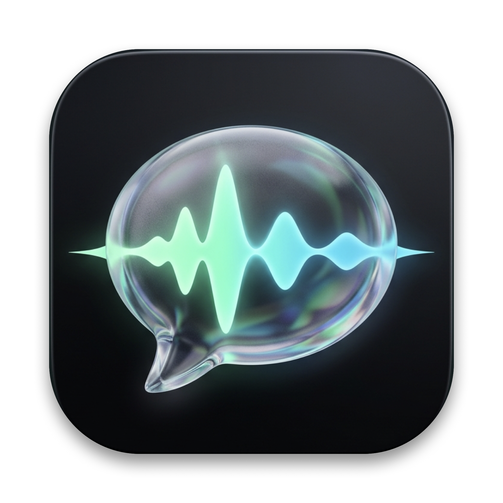

<p align="center">
  
</p>

<h1 align="center">CallCaption</h1>

<p align="center">
  <strong>Native, Ultra-Low Latency Live Call Captions & Real-Time Neural Translation for macOS</strong>
</p>

<p align="center">
  <a href="#features"></a>
  <a href="#features"></a>
  <a href="#features"></a>
  <a href="#features"></a>
  <a href="LICENSE"></a>
</p>

---

## 📖 Overview

**CallCaption** is a state-of-the-art macOS application that provides floating, real-time live captions and bidirectional language translation for voice and video calls (FaceTime, Zoom, Phone, Google Meet, VoIP, WhatsApp, and more).

Powered natively by Apple's on-device neural engines (`ScreenCaptureKit`, `AVAudioEngine`, and `SFSpeechRecognizer`), CallCaption requires **zero virtual audio cables** (no BlackHole or Soundflower required) and preserves your natural voice while projecting translated captions to both you and your caller.

```
┌────────────────────────────────────────────────────────────────────────┐
│                        MacBook / Mac Host (You)                        │
│                                                                        │
│   • Captures caller speech directly via ScreenCaptureKit               │
│   • Captures your voice directly via Built-in Mic / AirPods            │
│   • Translates bidirectionally via on-device Apple Speech Engine       │
│   • Displays floating HUD: Ambient Whisper Pill or Dynamic Island Pro  │
└───────────────────────────────────┬────────────────────────────────────┘
                                    │ Local Web Server & Secure Tunnel
                                    ▼
┌────────────────────────────────────────────────────────────────────────┐
│                    Remote Caller (iOS / Android / Web)                 │
│                                                                        │
│   • Scans QR code or opens phone link (no app download required!)      │
│   • Streams live translated captions in real time                      │
│   • Supports native Mobile Picture-in-Picture (PiP) over call apps     │
└────────────────────────────────────────────────────────────────────────┘
```

---

## ✨ Key Features

- **⚡ Zero Virtual Audio Cables**: Direct hardware loopback audio capture via macOS `ScreenCaptureKit` and `AVAudioEngine`. Works out-of-the-box with any headset, AirPods, or speakers.
- **🏝️ Dynamic Island Pro (Full Mode)**: Dual-stream split stage HUD featuring emerald green caller cards, cyan user cards, live audio waveform visualizer, 20+ language route selectors, and quick-access docks.
- **💬 Ambient Whisper (Compact Mode)**: Ultra-minimalist 50px pill banner displaying real-time caller translations, interactive translation route capsule (`🇪🇸 ES → EN 🇬🇧`), 4-bar equalizer, and single-click expand button.
- **📱 Phone Companion Web Captioner**: Remote callers scan a QR code to view live subtitles directly on their iPhone Safari or Android Chrome with zero app installation. Supports mobile Picture-in-Picture floating over call apps.
- **🗣️ 20+ Language Support**: Bidirectional speech recognition and translation across English, Spanish, French, German, Italian, Portuguese, Japanese, Chinese, Korean, Arabic, Russian, and more.
- **⚙️ Integrated System Permissions & Audio Diagnostic Window**: Comprehensive setup dashboard showing live authorization status (`Microphone`, `Speech Engine`, `Screen Recording`), a real-time mic signal test, and quick links to macOS System Settings.
- **📄 Live Call Transcript Logging**: Real-time transcript tracking with timestamps, speaker separation, clipboard copy, and `.txt` file export.
- **🔒 Privacy First**: On-device processing. No audio is ever stored on external cloud servers.

---

## 🎛️ User Interface Modes

### 1. Ambient Whisper (Compact HUD)
Default compact floating pill designed to sit unobtrusively at the top or bottom of your call window.

```
┌────────────────────────────────────────────────────────────────────────────────────────────────┐
│  🟢   [ 🇪🇸  ES → EN  🇬🇧 ]   Hello, how are you doing today?                 [QR]  ılılı  ⏸  ⤢  📌  │
└────────────────────────────────────────────────────────────────────────────────────────────────┘
```
- **Left Flag (`🇪🇸`)**: Click to select Caller language.
- **Right Flag (`🇬🇧`)**: Click to select Your language.
- **Center Route (`ES → EN`)**: Click to swap languages (`⇄`) or configure speech locales.
- **Right Controls Dock**: QR Share (`⌘S`), Live Equalizer, Pause (`Space`), Expand (`⌘M`), Pin Always-on-Top.

### 2. Dynamic Island Pro (Full HUD)
Expanded command center for multi-language management and detailed dual-speaker tracking.

- **Caller Subtitle Card (Emerald Glow)**: Live translated transcript of the incoming speaker.
- **You Subtitle Card (Electric Cyan Glow)**: Live confirmation transcript of your spoken audio.
- **Control Bar**: Audio test button, language switchers, transcript viewer, and system controls.

---

## ⌨️ Keyboard Shortcuts

| Shortcut | Action |
|:---:|:---|
| <kbd>⌘</kbd> <kbd>M</kbd> | Toggle between Compact Pill and Full Dynamic Island HUD |
| <kbd>Space</kbd> | Pause / Resume Live Captions |
| <kbd>⌘</kbd> <kbd>S</kbd> | Open Share & QR Code window for mobile caller |
| <kbd>⌘</kbd> <kbd>T</kbd> | Open Live Call Transcript Log |
| <kbd>⌘</kbd> <kbd>,</kbd> | Open System Permissions & Audio Setup dashboard |
| <kbd>⌘</kbd> <kbd>H</kbd> | Bring Captions HUD to front |
| <kbd>⌘</kbd> <kbd>Q</kbd> | Quit CallCaption |

---

## 🛠️ Build & Installation

### Requirements
- macOS 14.0 (Sonoma) or macOS 15.0+ (Sequoia)
- Apple Silicon (M1 / M2 / M3 / M4) or Intel Mac
- Xcode Command Line Tools (`xcode-select --install`)

### Quick Build
Clone the repository and run the build script:

```bash
git clone https://github.com/YOUR_USERNAME/CallCaption.git
cd CallCaption

# Build application bundle
./build.sh

# Run application
./run.sh
```

### Packaging Release DMG
To package a standalone, redistributable installer DMG:

```bash
./package.sh
# Output: CallCaption-Installer.dmg
```

---

## 📁 Repository Structure

```
CallCaption/
├── Sources/
│   ├── AppDelegate.swift              # App lifecycle & status bar menu item
│   ├── AudioCaptureEngine.swift       # ScreenCaptureKit & AVAudioEngine audio tap
│   ├── AudioVisualizerView.swift      # Real-time FFT audio visualizer & equalizer
│   ├── HUDCaptionWindow.swift         # Dynamic Island & Ambient Whisper floating HUD
│   ├── LanguageModels.swift           # Supported languages and locale definitions
│   ├── MobileClientHTML.swift         # Web client for phone companion (SSE + PiP)
│   ├── PermissionHelper.swift         # macOS TCC permission handlers
│   ├── PermissionsWindow.swift        # Interactive Permissions & Diagnostics window
│   ├── ShareWindow.swift              # QR code generator & phone link sharing window
│   ├── SpeechRecognitionManager.swift # Apple SFSpeechRecognizer transcription engine
│   ├── TranscriptManager.swift        # Call transcript accumulator & export logic
│   ├── TranscriptWindow.swift         # Live transcript viewer & text exporter
│   ├── TranslationEngine.swift        # On-device neural translation engine
│   ├── TunnelManager.swift            # Secure localhost tunnel for remote mobile access
│   ├── WebCaptionServer.swift         # Local HTTP/SSE server streaming subtitles
│   └── main.swift                     # Entry point
├── Resources/
│   ├── AppIcon.icns                   # Official macOS application icon bundle
│   ├── AppIcon.png                    # Lossless high-resolution master icon
│   ├── CallCaption.entitlements       # Security and sandbox entitlements
│   └── Info.plist                     # Application bundle metadata
├── build.sh                           # Clean compilation and ad-hoc code-signing
├── package.sh                         # Release DMG creation script
├── run.sh                             # Quick launch helper
├── .gitignore                         # Git exclusion rules
├── LICENSE                            # MIT License
└── README.md                          # Documentation
```

---

## 🔒 Permissions & Security

CallCaption requires the following macOS permissions to function:
1. **Microphone**: Needed to transcribe your spoken voice.
2. **Speech Recognition**: Uses Apple's local speech recognition engine.
3. **Screen & Audio Recording**: Needed by `ScreenCaptureKit` to capture incoming call audio directly from your speakers.

All permission requests can be monitored, tested, and resolved through the built-in **System Permissions & Audio Setup** window (<kbd>⌘</kbd> <kbd>,</kbd>).

---

## 📄 License

This project is licensed under the [MIT License](LICENSE).
